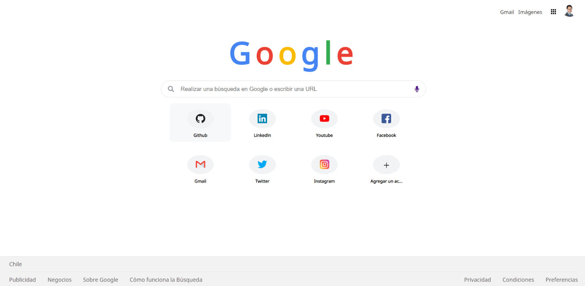

## Google Clone 

> Proyecto desarrollado bajo la cuarentena del Covid-19. 

La intención de este proyecto fue recrear y escribir en código puro, sin ayuda de Frameworks el landing page de Google, con su acceso rápido incluido. 

Puedes ver el proyecto de Google clone dando click [Aquí.](https://mattcri.github.io/google_clone/ "Aquí")

### Tecnologías Utilizadas: 
- CSS Grid
- Flex-box 
- Sass
- HTML
- JavaScript
